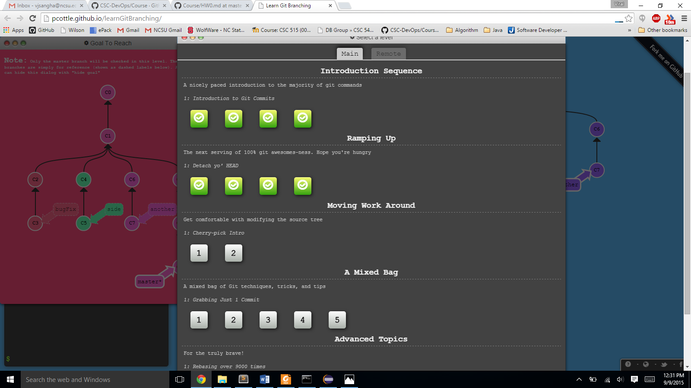
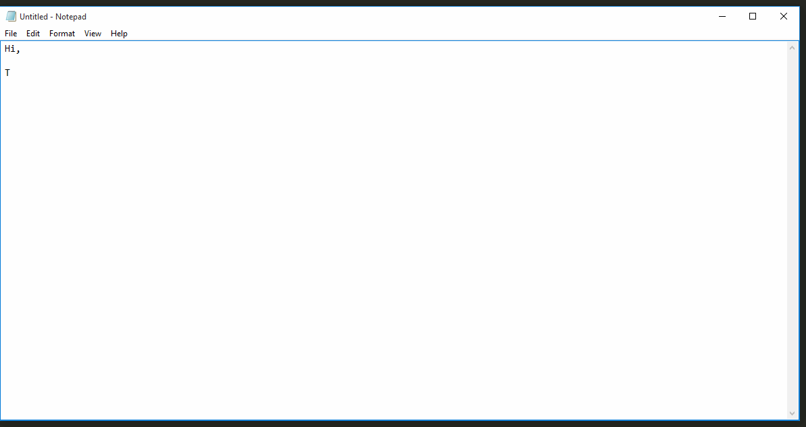

Git Excercise

* Level 1: Introduction to git commits
	* Taks 1  
	
			1. git commit -m "first commit"
			2. git commit -m "second commit"
   * Task 2 
   
		    1. git checkout -b bugFix
   * Task 3
   
	 	    1. git checkout -b bugFix
		  	2. git commit -m "bugFix commit"
			3. git checkout master
			4. git commit -m "master commit"
			5. git merge bugFix
    * Task 4
    
			1. git checkout -b bugFix
			2. git commit -m "bugFix commit"
			3. git checkout maser
			4. git commit -m "master commit"
			5. git checkout bugFix
			6. git rebase master
* Level 2: Detach yo' HEAD
	* Taks 1
	
		    1. git checkout C4  
	* Taks 2 
	
	    	1. git checkout bugFix^
	* Taks 3
	
		 	1. git branch -f master C6	 	
			2. git checkout C1
			3. git branch -f bugFix HEAD~1
	* Taks 4  
	
			1. git reset HEAD~1
			2. git checkout pushed
			3. git revert HEAD

Screenshot

			
Hooks script: post-commit

	#!/bin/sh     
	start http://google.com 

Hooks Excercise Gif

